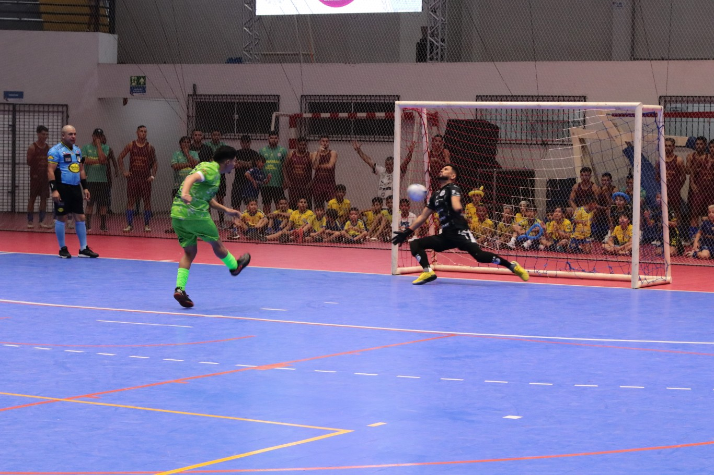

# ⚽ Sistema de Captura de Highlights Esportivos com Raspberry Pi

## 📌 Visão Geral

Este projeto tem como objetivo desenvolver uma solução embarcada para gravação automática de vídeos de **momentos de destaque (highlights)** em partidas de esportes de quadra, como futebol society, futsal, vôlei, tênis e outros.  

Diferente de soluções existentes no mercado, que utilizam **botões físicos dentro do campo** (causando atrasos e pouca praticidade), esta solução utiliza **Visão Computacional e Inteligência Artificial embarcada** para detectar gestos específicos feitos pelos jogadores e **acionar automaticamente a gravação dos últimos 30 segundos da partida**.

---

## ⚙️ Funcionamento do Sistema

1. A **Raspberry Pi 2 B+** coleta imagens continuamente da **Pi Camera**.
2. Devido ao limitante computacional da plataforma embarcada, será feita uma captura de imagem 0.5 segundo. Essas as imagens são processadas por um modelo de **IA de visão computacional** para identificar um gesto pré-definido (ex: **braços cruzados em X**, feito por um jogador após um gol).
3. Quando o gesto é detectado:
   - Um **LED de alta potência** acende.
   - Um **buzzer sonoro** emite um sinal confirmando a captura.
   - Os **últimos 30 segundos de vídeo são salvos** localmente em formato `.mkv` ou `.mp4`.
4. Cada vídeo salvo contém:
   - Temperatura ambiente no momento da jogada
   - Data e hora exata
   - Duração da gravação
5. Ao final da partida, os vídeos são enviados automaticamente ao cliente por **WhatsApp ou e-mail**, conforme configuração feita no **cadastro do usuário no sistema do estabelecimento esportivo**.

---

## 🧩 Componentes de Hardware

- **Raspberry Pi 2 B+** (SBC - Single Board Computer)  
- **Câmera oficial do Raspberry Pi**  
- **Buzzer potente**  
- **LED de alta potência**  
- **Sensor de temperatura**  
- **Fonte de alimentação externa 5V**  

---

## 🖥️ Componentes de Software

- Sistema Operacional: **Linux embarcado (Raspberry Pi OS)**  
- Linguagens: **Python** (processamento e controle)  
- Bibliotecas principais:
  - OpenCV (visão computacional)
  - NumPy (processamento de dados)
  - GPIO Zero / RPi.GPIO (controle de hardware)
  - smtplib / API do WhatsApp (envio dos vídeos)
- Armazenamento: Cartão microSD

---

## 📡 Interfaces e Comunicação

- GPIOs para controle de LED, buzzer e sensor de temperatura  
- I2C para o sensor de temperatura  (ou thermistor)
- Wi-Fi / Ethernet para envio de vídeos e sincronização do horário

---

 

## 👥 Público-Alvo e Aplicações

- Quadras de futebol society ou futsal  
- Quadras de vôlei (areia ou indoor)  
- Quadras de tênis e outros esportes com público  
- Estabelecimentos esportivos que desejam oferecer vídeos personalizados de jogadas para seus clientes

---

## 📌 Status do Projeto

🚧 Em desenvolvimento — Etapa: Caracterização do Sistema Embarcado (Parte 1 do relatório)

---

## ✍️ Autores

- Nº USP 11734490  — Lucas Sales Duarte
- Nº USP    13835472 — João Ferreira Battaglini 

Disciplina **SEL0630 - Projetos em Sistemas Embarcados**  
Universidade de São Paulo (USP) – Campus São Carlos
